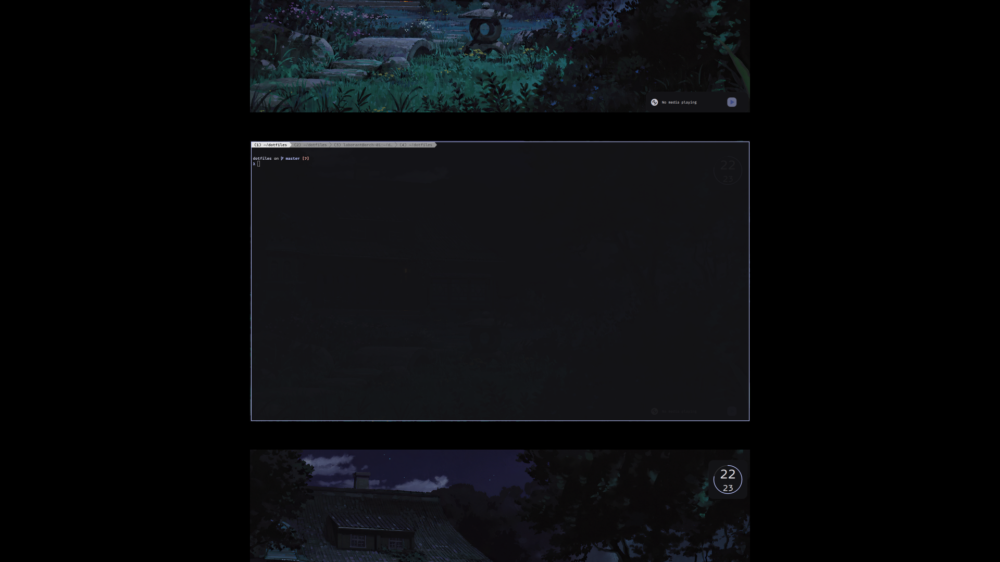
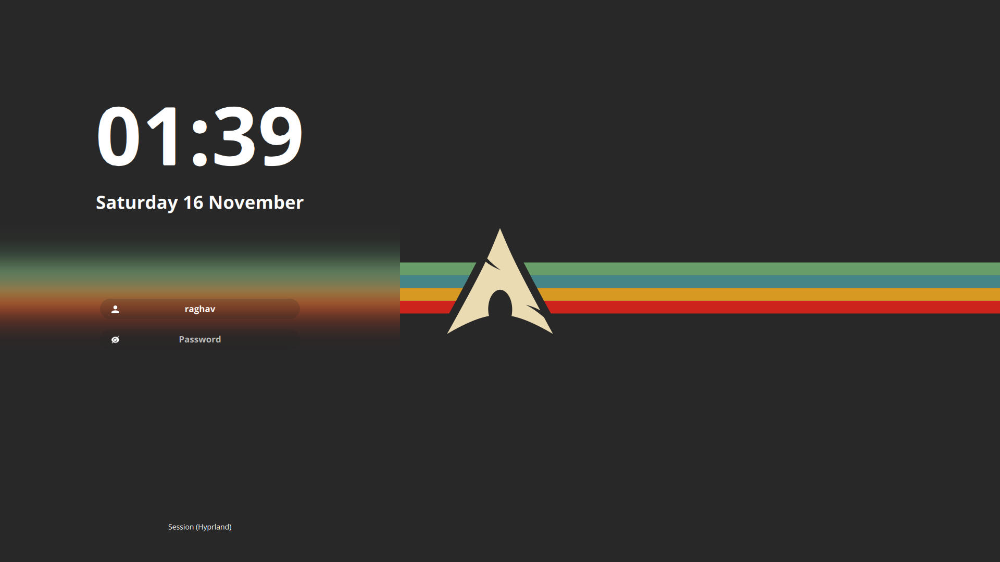

# ArchBTW
Back to Arch after trying out NixOS (NixOS config [here](https://github.com/ChrolloKryber/dotfiles/tree/nixOS))

Hyprland Setup
---

### My Environment
- Hyprland as WM
- Waybar for status bar
- Kitty as terminal emulator
- [Neovim](https://github.com/chrollokryber/neovim) as editor/IDE of choice
- Gruvbox for color themes nwg-look
---

Thanks to @XNM1's [hyprlock config](https://github.com/XNM1/linux-nixos-hyprland-config-dotfiles/)
And even bigger thanks to @JaKooLit's amazing [dotfiles](https://github.com/JaKooLit/Hyprland-Dots/)
