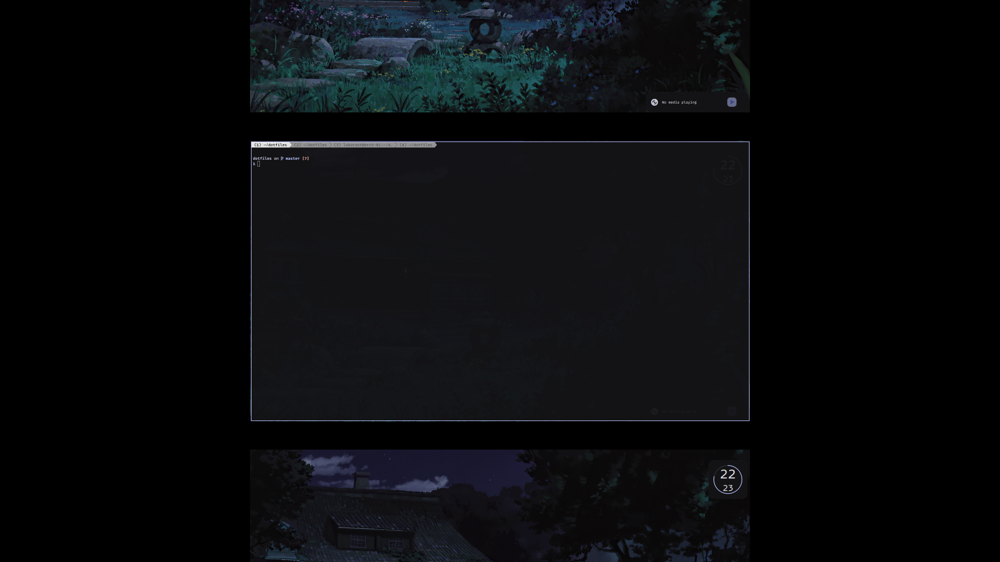
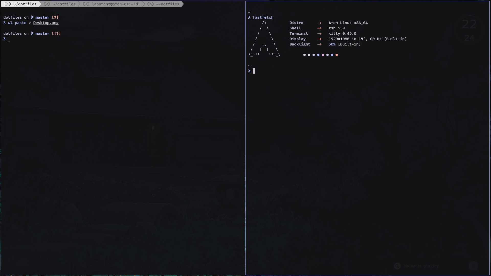

# ArchBTW

Hyprland Setup
---



### My Environment
- [Niri](https://github.com/niri-wm/niri) as WM
- [Noctalia Shell](https://github.com/noctalia-dev/noctalia-shell) for status bar and other utilities
- [Kitty](https://github.com/kovidgoyal/kitty) as terminal emulator
- [Neovim](https://github.com/chrollokyber/neovim) as editor/IDE of choice
- Colors generated by Noctalia Shell using [matugen](https://github.com/InioX/matugen)
- [Ghibli Wallpapers](https://github.com/chrollokyber/ghibli-wallpapers)
---

Simply clone the repo and run the install script
```sh
git clone https://github.com/ChrolloKyber/dotfiles && \
cd dotfiles && bash install.sh
```
